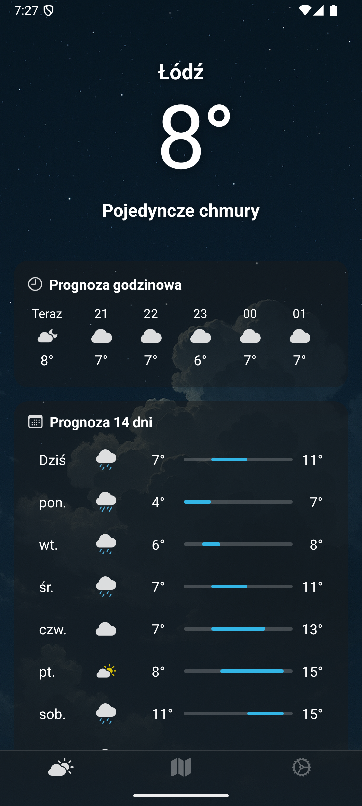
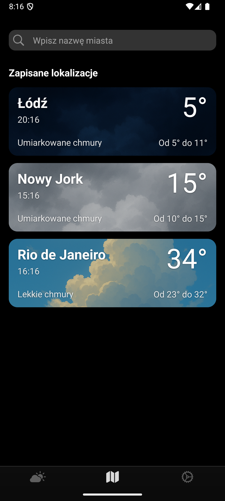
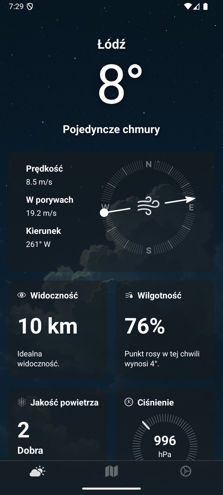
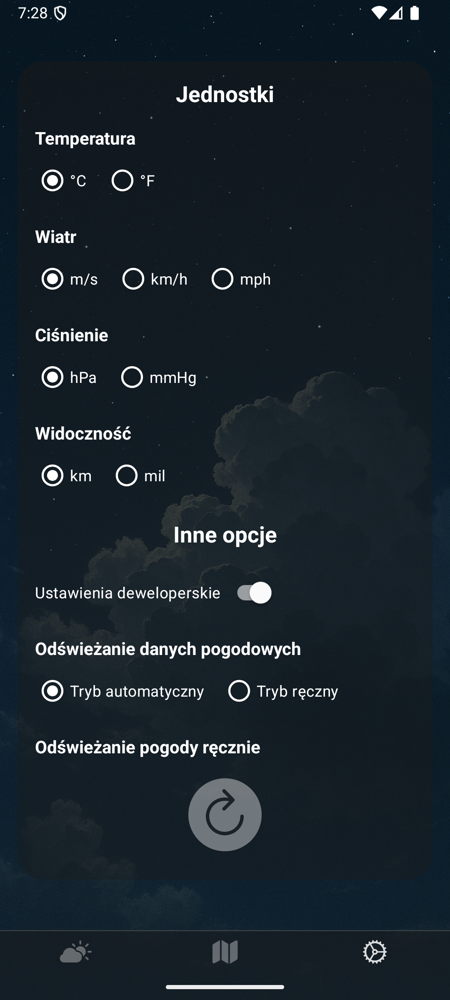

# Android Weather Application

A clean, native Android weather application in Java utilizing the OpenWeather API for real-time data.

## About This Project

This is a native Android application built with Java that provides users with current weather conditions and a multi-day forecast. The app fetches and displays data for user-selected locations by integrating directly with the live [OpenWeather API](https://openweathermap.org/api).

The project's focus was on implementing clean UI/UX principles, efficiently handling asynchronous network requests (using Volley) and parsing complex JSON responses.

## Key Features

* **Real-time Data:** Fetches current temperature, humidity, wind speed, and weather conditions.
* **Forecast:** Displays a multi-day forecast for the selected location.
* **Dynamic UI:** Updates the interface based on the weather data received.
* **API Integration:** Demonstrates successful integration with a third-party RESTful API.
* **Error Handling:** Includes basic error handling for network failures or invalid location entries.

## Technologies Used

* **Language:** Java
* **Platform:** Android SDK
* **API:** OpenWeather API
* **Networking:** Volley (API Requests)
* **JSON Parsing:** org.json

## Screenshots

| Main Screen (1/2) | Locations View |
| :---: | :---: |
|  |  |
| Main Screen (2/2) | Settings View |
| :---: | :---: |
|  |  |

## Setup

1.  **Clone the repository:**
    ```bash
    git clone [https://github.com/ekl3m/TWOJA-NAZWA-REPO.git](https://github.com/ekl3m/TWOJA-NAZWA-REPO.git)
    ```
2.  **Open in Android Studio:**
    Open the project directory in Android Studio.
3.  **Get API Key:**
    Obtain a free API key from [OpenWeather](https://openweathermap.org/api).
4.  **Add API Key:**
    Locate the placeholder for the API key in the project (WeatherApiClient) and insert your key.
5.  **Build & Run:**
    Build and run the application on an Android device or emulator.

## License

This project is licensed under the GNU General Public License v3.0 - see the [LICENSE](LICENSE) file for details.
